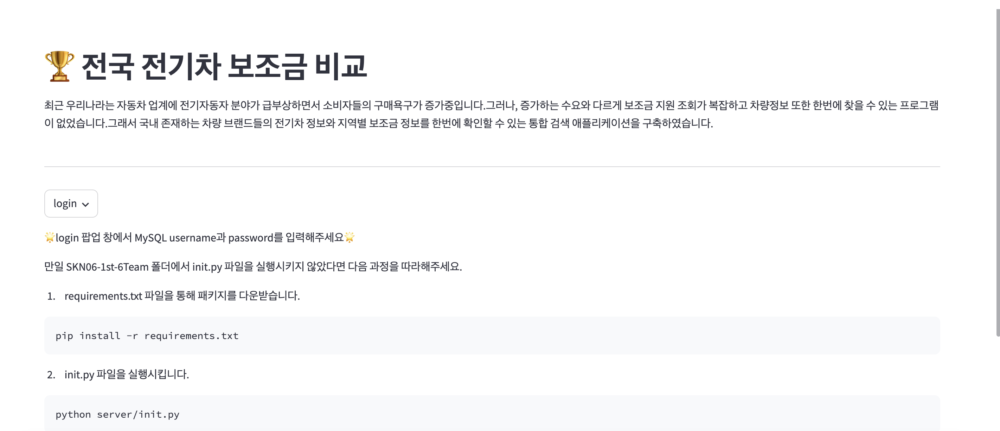
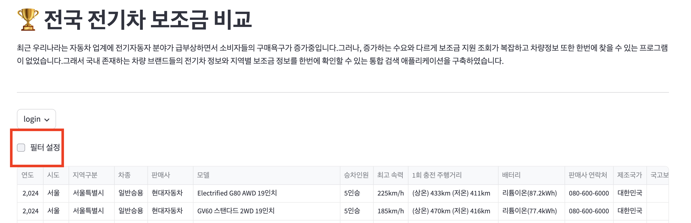
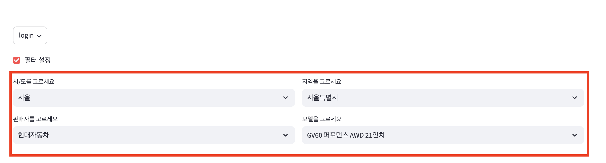

# SKN06-1st-6Team
<div align="center">


[](https://hits.seeyoufarm.com)

</div>

# 전기차 보조금 조회 애플리케이션 
> **SK Networks AI CAMP 6기** <br/> **개발기간: 2024.10.11 ~ 2024.10.15** <br/> **팀명: 코딩모지** 

## 개발팀 소개

| 박유나 | 박미현 | 정유진 | 정민준 |
|:----------:|:----------:|:----------:|:----------:|
|  |  |  |   |
| [@Yuna Park](https://github.com/yunazz) | [@Park, Mihyeon](https://github.com/ppim321) | [@RealOil](https://github.com/RealOil) | [@MinJun Jung](https://github.com/samking1234-Apple) |
| DB | Streamlit디자인 | Streamlit | Crawling |

## 프로젝트 개요 및 소개
최근 우리나라는 자동차 업계에 전기자동자 분야가 급부상하면서 소비자들의 구매욕구가 증가중이다. 그러나, 증가하는 수요와 다르게 보조금 지원 조회가 복잡하고 차량정보 또한 한번에 찾을 수 있는 프로그램은 없었다.
저희는 이러한 불편함을 개선하고자 국내 존재하는 차량 브랜드들의 전기차 정보와 지역별 보조금 정보를 한번에 확인할 수 있는 **통합 검색 애플리케이션**을 구축하였습니다.

## 시작 가이드
### Requirements
For building and running the application you need:

- [MySQL 8.0.37](https://dev.mysql.com/downloads/installer/)
- [Python >= 3.11.7](https://www.python.org/downloads/release/python-3119/)

### Installation
``` bash
$ git clone https://github.com/SKNETWORKS-FAMILY-AICAMP/SKN06-1st-6Team.git
$ cd SKN01-1st-6Team
$ pip install -r requirements.txt
```

### Step-by-Step guide
1. 서버 기초 세팅: Crawling > DDL > DML
   - 전기차종별 정보, 지역별 보조금 정보를 크롤링하여 JSON 파일로 저장 (./server/data 디렉토리에 저장)
   - DDL(Data Definition Language): DB 및 Table 생성
   - DML(Data Manipulation Language): 크롤링한 데이터를 DB에 저장
```bash
$ python server/init.py
```

2. **Streamlit**을 이용하여 `app.py` 웹앱 실행
```bash
$ streamlit run app.py
```
---
## 📚 Stacks 

### Environment


             

### Development
 


### Communication


## 📺 화면 구성 
| INFO | RESULT |
| :------------: | :------------: |
|   |  |

---
##📱 애플리케이션 사용법 

1. 처음 화면에서 본인의 mysql root 서버의 이름과 비밀번호를 입력한다.


2. 필터설정 버튼을 클릭한다.



3. 본인이 원하는 지역과 자동차 제조사, 모델명을 설정한다.



4. 아래 검색된 선택 지역 및 기종의 보조금액, 해당지역 담당부서 번호, 선택 기종의 타지역 보조금액 과 선택 기종의 세부 정보를 확인한다.


---

## 📦 기능 소개 

### 지역별 보조금 조회
 - 선택한 지역의 지역 보조금, 국비 보조금, 전체 보조금을 확인할 수 있다.
### 차종별 정보 제공
 - 선택한 차종에 대한 자세한 정보를 확인할 수 있다.
### 지역별 담당부서 번호 제공
 - 선택한 지역에 대한 전기차 담당부서의 정보를 확인할 수 있다.
### 차종별 정보 제공
 - 선택한 차종에 대한 타지역 보조금 정보를 확인할 수 있다.
   
---
## 아키텍처

### 디렉토리 구조
```bash
.
├── server
│   └── crawling
│       ├── data
│           ├── car_detail.json : 차량 상세 정보 크롤링 결과값
│           ├── car.json : 자동차, 보조금 관련 크롤링 결과값
            └── city.json : 도/시 정보 및 지역 상담 연락처
│       ├── car_detail.py
│       ├── city.py
│       └── subsidy.py
│   └── db
│       ├── ddl.py
│       ├── dml.py
│       └── sql_query.py
└── app.py : Streamlit을 이용한 Webapp runner
```

### 데이터베이스 구조 (ERD)


---

## 💁‍♀️💁‍♂️ 팀원 리뷰 💁‍♂️💁‍♀️
#### To. 박유나 팀원
> **박미현** - 프로젝트 주제가 결정되자, 빠른 기획과 추진력으로 팀원들의 의견을 취합해주시는 팀장님 면모!
>
> **정유진** - 제일 먼저 앞장서서 해준 적절한 역할 배분과 중간중간의 피드백이 너무 좋았습니다. 그리고 DB에서 데이터를 끌어와 쓸 때마다 잘 정리된 예제 DB로 코드를 짜는 건가 싶을 정도로 잘 정리하셔서 너무 든든했습니다.
> 
> **정민준** - 유 경험자로서 팀을 이끌어준거 같아 항상 든든했습니다. 앞으로 다시 팀이 된다고 해도 좋을 1인이라고 말할 정도였습니다.

#### To. 박미현 팀원
> **박유나** - 문제를 파악하고 흐름을 이해하는 능력이 뛰어나며, 요구 사항을 정확하게 반영해 주셔서 실무 경험이 풍부하신 분이라는 느낌을 받았습니다. 참신한 아이디어를 꾸준히 제시해 주셔서 큰 도움이 되었고, 다양한 방법과 도구를 활용한 문제 해결 능력이 인상 깊었습니다. 정말 ‘아이디어 뱅크’라는 표현이 잘 어울리는 분입니다.
>
> **정유진** - 우리 팀 프로젝트는 주제 선정부터가 최고의 선택이었다 생각될 정도로 초기 주제 선정이 너무 좋았고, 아무도 잘 몰랐던 streamlit을 맡아서 다양하게 봐주신 덕분에 이어 만들 때도 편했습니다. 막힐 때마다 같이 고민하고 비슷한 예제들을 구해주신 것도 든든했습니다.
> 
> **정민준** - 주제 선정에 큰 도움을 주셔서 감사하고 streamlit을 맞아주셔서 든든했습니다!

#### To. 정유진 팀원  
> **박유나** - 본인이 맡은 일에 대한 책임감이 높고, 문제를 마주할 때마다 적극적으로 여러 시도를 하며 해결해 나가는 모습이 인상 깊었습니다. 항상 긍정적인 자세로 팀워크를 이루며 프로젝트의 질을 높여주어 고마웠습니다.
>
> **박미현** - 조용하지만 강했다, 어느새 완성해서 보여주시는 완벽함(대체 언제 다 하신거죠?)
> 
> **정민준** - 항상 꼼꼼하고 부지런했던 팀원이었습니다. 제가 부족한 부분을 항상 신경 써주고 도와줘서 고마웠고 자신이 맡은 부분이 아니라도 해결해 주는 모습이 좋았습니다.

#### To. 정민준 팀원  
> **박유나** - 맡은 일에 끝까지 최선을 다하며 해결하고자 하는 끈기 있는 모습이 정말 인상적이었습니다. 문제를 포기하지 않고 결과물로 이어가는 과정에서 책임감과 열정이 느껴졌고, 분업을 통해 팀워크를 잘 이뤄내는 모습 역시 좋았습니다.
>
> **박미현** - 문제 해결을 위해 치밀하게 파고드는 집요함이 정말 멋졌습니다. 
> 
> **정유진** - 내일까지 이 부분을 해결해오겠다 했을 때 정말 해결해오고 심지어 기존보다 더 개선된 방향으로 코드를 짜오셔서 정말 대단하고 든든했습니다. 발표 때도 우리의 의도와 실행 방법 등을 잘 보여줘서 더 든든했던 거 같습니다.

